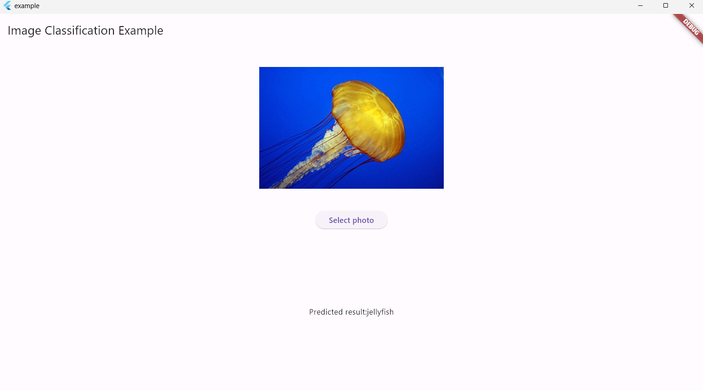

# Pytorch_Dart{ignore=true}

Pytorch_Dart is a Dart wrapper for Libtorch, designed to provide a seamless experience akin to [PyTorch](https://github.com/pytorch/pytorch).

It serves as an alternative to NumPy for Dart/Flutter projects.

**This package is experimental and APIs may change in the future**.

| Platform | Status | Prebuilt binaries                               |
| -------- | ------ | ----------------------------------------------- |
| Windows  | ✅     | x64(without CUDA)                               |
| Android  | ✅     | arm64-v8a<br />armeabi-v7a<br />x86_64<br />x86 |
| Linux    | ✅     | x64(without CUDA)                               |
| iOS      | ❌     | coming soon                                     |
| MacOS    | ❌     | coming soon                                     |

Note: To run Pytorch_Dart on MacOS, replace `/libtorch-linux/libtorch` with libtorch for MacOS.

[toc]

## Getting Started

### Add pytorch_dart to your pubspec.yaml

To include Pytorch_Dart in your Dart/Flutter project, add the following to your `pubspec.yaml` and then save `pubspec.yaml` :

```dart
    pytorch_dart:^0.2.3
```

### Setup

Run the setup command below:

```powershell
flutter pub get
dart run pytorch_dart:setup --platform <your_platform>
```

`<your_platform>` only support `linux` , `android` and `windows` now.(iOS coming soon)

For windows developers,if you use debug version of libtorch,the program works well in debug mode but throw some exceptions when you build in release mode and vice versa.

If you need to build in release mode,you have to install the release version of libtorch.

The setup process will install the debug version by default.If you want to get release version of libtorch,run:

```
dart run pytorch_dart:setup --platform windows release
```

### Enjoy it!

Now you can import Pytorch_Dart in your Dart/Flutter project:

```dart
    import 'package:pytorch_dart/pytorch_dart.dart' as torch;

```

### For Android developers

Libtorch for Android requires a specific version of the NDK. Install NDK version 21.4.7075529 as instructed [here](https://developer.android.com/studio/projects/install-ndk?hl=zh-cn).

Add the NDK path to your project's `android/local.properties`:

```dart
ndk.dir=<path_to_your_ndk>/21.4.7075529
```

Ensure that your `local.properties` file looks similar to:

```gradle
flutter.sdk=/home/pc/flutter
sdk.dir=/home/pc/Android/Sdk
flutter.buildMode=debug
ndk.dir=/home/pc/Android/Sdk/ndk/21.4.7075529
```

Also,`torch.load()` and `torch.save()` are not available on Android.

### Troubleshooting

#### Windows

```
Launching lib\main.dart on Windows in debug mode...
√  Built build\windows\x64\runner\Debug\example.exe.
Error waiting for a debug connection: The log reader stopped unexpectedly, or never started.
Error launching application on Windows.
```

##### Solutions:

1. Download libtorch from [here](https://download.pytorch.org/libtorch/cpu/)(Download `libtorch-win-shared-with-deps-2.2.2+cpu.zip` if you want to run in release mode,and download `libtorch-win-shared-with-deps-debug-2.2.2+cpu.zip` if you want to run in debug mode.)
2. Unzip it
3. copy all the files from `libtorch\lib\` to `build\windows\x64\runner\Debug\` (debug mode) or `build\windows\x64\runner\Release`(release mode)

## Usage

### Brief Introduction

1. It include some basic functions in [torch](https://pytorch.org/docs/stable/torch.html) now.
2. Support for inferencing TorchScript models.
3. **Almost all function usages remain consistent with PyTorch.**
4. **Broadcasting also works for pytorch_dart.**
5. Support for [torch.nn](https://pytorch.org/docs/stable/nn.html) is coming soon.
6. Example

```dart
var d=torch.eye(3,2);
print(d);
```

Result:

```
flutter:
 1  0
 0  1
 0  0
[ CPUFloatType{3,2} ]
```

### Operator overloading

Attention:Dart has no magic functions(like `_radd_` in python).Therefore, in binary operators, tensor can only be on the left side.

Example

```dart
import 'package:pytorch_dart/pytorch_dart.dart' as torch;
...

var c=torch.DoubleTensor([[1.0,2.0,3.0],[4.0,5.0,6.0]]);
var d=c+10;// no exception
var e=10+c;//throw exception
```

Other binary operators (`-`,`*`,`/`)are just like `+`

For operator `[]` ,you can use it just like in Pytorch.

However,in current version,slicing is not supported.Therefore,you cant't use `[a:b]` to select sub tensor.

Example

```dart
import 'package:pytorch_dart/pytorch_dart.dart' as torch;
...

var c=torch.DoubleTensor([[1.0,2.0,3.0],[4.0,5.0,6.0]]);
print(c[0][0]);
```

Result

```dart
flutter: 1
[ CPUDoubleType{} ]
```

### Model Inferencing

About how to get a TorchScript Model,see [here](https://h-huang.github.io/tutorials/recipes/torchscript_inference.html).

In Pytorch,we use `torch.jit.load()` to load TorchScript Models and `module.forward()` to inference.

In Pytorch_Dart,we have equivalent functions:`torch.jit_load()` and `module.forward()`.They have some small differnece with their Pytorch version.

`torch.jit_load()` is just like `torch.jit.load()` in Pytorch,but it is an asynchronous function because we use `rootBundle`.

To load a model,see example below:

```

torch.JITModule? module;
void _loadModel() async{
  module=await torch.jit_load('assets/traced_resnet_model.pt');
}
```

However,`forward()` has some differences with the original Pytorch version.

In Dart,it receives  `List <Dynamic>`  which means the input of the function `forward()` can be `List<Tensor>`,`List<Scalar>` or etc.

If the input of your model is a single tensor:

In Python, the following code is written:

```
outputTensor = module.forward(inputTensor)
```

But in Dart,you have to put `inputTensor` into a list:

```
var outputTensor = module!.forward([inputTensor]);   //! is a null-check opeator
```

Attention:Half tensors are not supported yet.

#### Example

We provide an image classigfication example in [/example](https://github.com/Playboy-Player/pytorch_dart/tree/main/example).



To run the example,see [pytorch_dart_standalone_examples](https://github.com/KernelInterrupt/pytorch_dart_standalone_examples) or run the code below:

```shell
git clone https://github.com/Playboy-Player/pytorch_dart
cd pytorch_dart
git submodule init
git submodule update --remote
dart run pytorch_dart:setup --platform <your_platform>
cd example
flutter run --debug //or "flutter run --release"

```

## Functions/APIs

Just like Pytorch,functions in Pytorch_Dart are divided into multiple parts.

In current version,APIs are dividied into 3 parts:

* **torch**
* **torch.tensor**
* **torch.jit**

### torch

#### Supported Functions

1. `torch.tensor()` is not supported in pytorch_dart,use `torch.IntTensor()`,`torch.FloatTensor()` or `torch.DoubleTensor()` to create tensors.
2. Functions avaliable now:
   Attention: parameters wrapped by `{}` are optional parameters.

   ```

   torch.ones(List<int> size,{bool requiresGrad = false, int dtype = float32, Device? device_used})
   torch.full(List<int> size, num values,{int dtype = float32, bool requiresGrad = false, Device? device_used}))
   torch.eye(int n, int m,{bool requiresGrad = false, int dtype = float32, Device? device_used})
   torch.IntTensor(List<int> list)
   torch.FloatTensor(List<double> list)
   torch.DoubleTensor(List<double> list)
   torch.arange(double start, double end, double step,{bool requiresGrad = false})
   torch.linspace(double start, double end, int steps,{bool requiresGrad = false})
   torch.logspace(double start, double end, int steps, double base,{bool requiresGrad = false})
   torch.equal(Tensor a,Tensor b)
   torch.add(Tensor a, tensor b,{double alpha=1})
   torch.sub(Tensor a, tensor b,{double alpha=1})
   torch.mul(Tensor a, tensor b)
   torch.div(Tensor a, tensor b)
   torch.add_(Tensor a, tensor b,{double alpha=1})
   torch.sub_(Tensor a, tensor b,{double alpha=1})
   torch.mul_(Tensor a, tensor b)
   torch.div_(Tensor a, tensor b)
   torch.sum(Tensor a)
   torch.mm(Tensor a, Tensor b)
   torch.transpose(Tensor a,int dim0,int dim1)
   torch.permute(Tensor a,List <int> permute_list)
   torch.save(Tensor a,String path)
   torch.load(String path)
   torch.relu()
   torch.leaky_relu()
   torch.tanh()
   torch.sigmoid()
   torch.flatten(Tensor a, int startDim, int endDim)
   torch.unsqueeze(Tensor tensor, int dim)
   torch.clone(Tensor tensor)
   torch.topk(Tensor a, int k,{int dim = -1, bool largest = true, bool sorted = true})
   torch.allClose(Tensor left, Tensor right,{double rtol = 1e-08, double atol = 1e-05, bool equal_nan = false})
   torch.empty(List<int> size,{bool requiresGrad = false, int dtype = float32, Device? device_used})
   torch.ones(List<int> size,{bool requiresGrad = false, int dtype = float32, Device? device_used})
   torch.full(List<int> size, num values,{int dtype = float32, bool requiresGrad = false, Device? device_used}))
   torch.eye(int n, int m,{bool requiresGrad = false, int dtype = float32, Device? device_used})
   ```
3. Almost all function usages remain consistent with PyTorch.
4. Some in-place operation are supported,such as `torch.add_()`
5. Example Usage

   ```dart
   import 'package:pytorch_dart/pytorch_dart.dart' as torch;
   ...

   var c=torch.DoubleTensor([[1.0,2.0,3.0],[4.0,5.0,6.0]]);
   var d=torch.add(10,c)
   print(d)
   ```

   Result:

   ```dart
   flutter:
    11  12  13
    14  15  16
   [ CPUDoubleType{2,3} ]
   ```

### torch.tensor

1. ##### `torch.tensor` Methods


   * `.dim()`
   * `.dtype()`
   * `.shape()`
   * `.size()`
   * `.detach()`
   * `.add_()`
   * `.sub_()`
   * `.mul_()`
   * `.div_()`
   * `.toList()`
   * `.unsqueeze(int dim)`
   * `.clone()`
   * `.relu()`
   * `.leaky_relu()`
   * `.sigmoid()`
   * `.tanh()`
   * `.flatten()`
   * `.equal(Tensor other)`
   * `.sum()`
   * `.mm(Tensor other)`
   * `.view(List <int> size)`

   **Note:** The `.dtype()` method in Pytorch_Dart differs from PyTorch. In PyTorch, `.dtype` returns an object representing the tensor's data type. In Pytorch_Dart, `.dtype()` returns a numerical representation of the data type. This may be updated in future versions.
2. Example

   ```dart
   import 'package:pytorch_dart/pytorch_dart.dart' as torch;
   ...

   var c=torch.DoubleTensor([[1.0,2.0,3.0],[4.0,5.0,6.0]]);
   print(c.dtype())
   ```

   Result

   ```dart
   flutter: 7
   ```

   `7` represents `torch.float64.`

   All the corresponding relations are in `lib/src/constants.dart`
3. Other function usages remain consistent with PyTorch.

### torch.jit

See [Model Inferencing](#Model-Inferencing).

## Roadmap

1. Add support for iOS and MacOS.
2. Add support for other functions,such as `torch.nn`

## Acknowledgement

This project leverages contributions from [pytorch-flutter-FFI-example](https://github.com/dvagala/pytorch-flutter-FFI-example) ,[gotorch](https://github.com/wangkuiyi/gotorch) and [TorchSharp](https://github.com/dotnet/TorchSharp)
